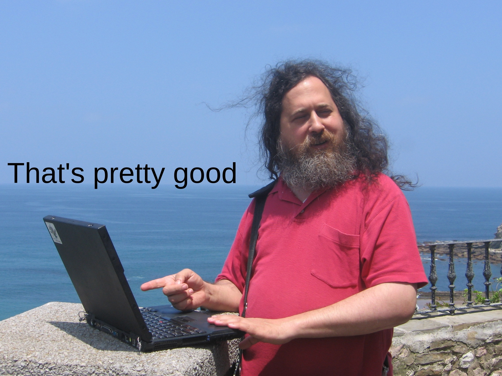

<!--suppress ALL -->

# 📟  Matheus Luiz  [](https://github.com/matheusluizn) [](https://www.linkedin.com/in/matheusluizn/)


<h4 align="center"> “What I cannot create, I do not understand.” – Richard Feynman </h3>



```C
#include <stdio.h>
int main()
{

   char s[100] = "Greetings, I'm Matheus Luiz";
   int c = 0;
   while (s[c] != '\0') {
      printf("%c", s[c]);
      c++;
   }
   return 0;

}
```

# ⚡️ Languages/Technologies

         
# 📉 Analysis 


